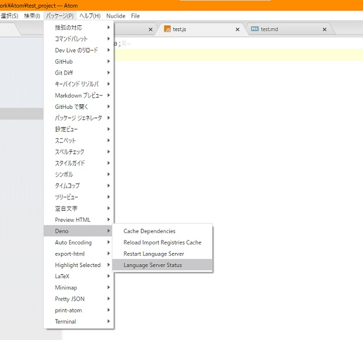
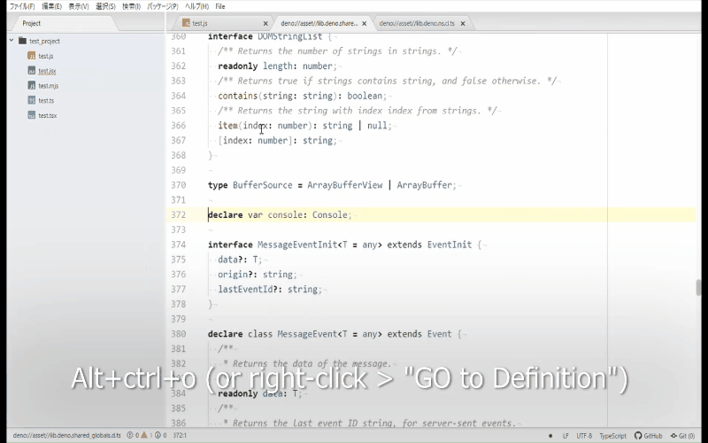

See the
[github release page](https://github.com/ayame113/atom-ide-deno/releases) for
future releases.

## 1.8.0

- Update dependencies (#43)

## 1.7.0

- fix bug (Uncaught TypeError: e?.getURI is not a function #40)

## 1.6.0

- Auto config for Deno and Node.js
  - Toggle between Deno mode and Node.js mode with a one click.
  - You can freely combine the runtime (Deno or Node.js), linter (deno_lint or
    eslint), and formatter (deno_fmt or prettier).
- fix bug when outline-view result was null
  (https://github.com/atom-community/atom-languageclient/pull/150)

## 1.5.0

- format on save
- format on Format Current File command (or menu > packages > Deno > Format
  Curent File)
- format on Format All File command (or menu > packages > Deno > Format All
  File)

## 1.4.0

- Hotfix because 1.3 is broken
- The package size was temporarily bloated.

## 1.3.0

- supports json file
- supports ignature help provider
- use typescript in this package's code
- supports command pallet (`ctrl+shift+p`)
  - Cache Dependencies
  - Reload Import Registries Cache
  - Restart Language Server
  - Language Server Status 
- add menus (`menu bar > Packages > Deno`)
  - same support as command 

## 1.2.0

- supports "Go to Definition"
  
- add hosts that support import completion to the default settings
- Preparing commands for custom request
  - ~~For developers: You can try a custom request by opening a console with
    `ctrl-shift-i` and typing the following command:~~
  <details>

<summary>this is not work in current version</summary>
```js
await atom.packages.activePackages["atom-ide-deno"].mainModule.provideDenoCache()
await atom.packages.activePackages["atom-ide-deno"].mainModule.provideDenoCacheAll()
await atom.packages.activePackages["atom-ide-deno"].mainModule.provideDenoPerformance()
await atom.packages.activePackages["atom-ide-deno"].mainModule.provideDenoReloadImportRegistries()
await atom.packages.activePackages["atom-ide-deno"].mainModule.showDenoStatusDocument()
await atom.packages.activePackages["atom-ide-deno"].mainModule.provideDenoVirtualTextDocument({uri: 'deno:/status.md'})
```
</details>

## 1.1.0

- supports Import Completions

## 1.0.0

- supports importMap
- supports tsconfig
- supports executable path

## 0.1.2 - First Release

- the minimum functionality to use the deno language server with the Atom-IDE.
