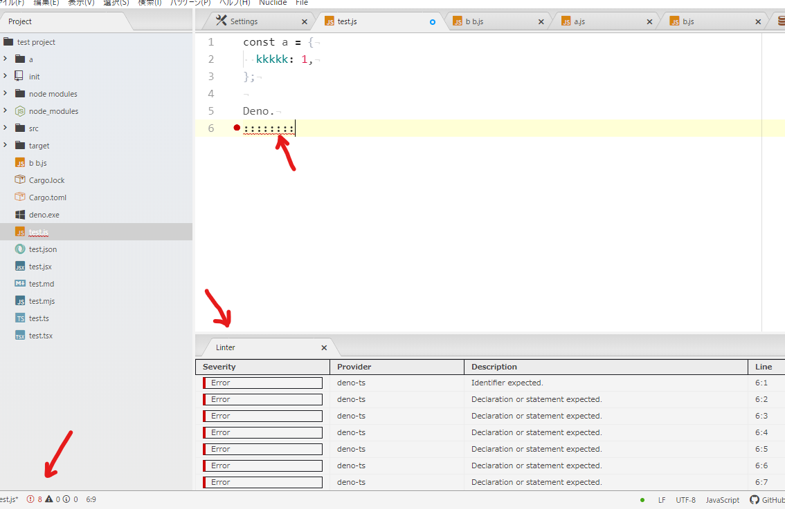

The Atom IDE UI package has been migrated to a separate package, including the
Atom IDE Base. The Atom IDE UI package has been abandoned and some features no
longer work. However, the migration is still in progress, so some features of
the Atom IDE UI package are still available.

Implementation list of Deno and Atom IDE

|                                  | UI                                                    | Base                       |                                               |   |
| -------------------------------- | ----------------------------------------------------- | -------------------------- | --------------------------------------------- | - |
| window/showMessage               |                                                       | ○                          |                                               |   |
| window/showMessageRequest        |                                                       | ○                          |                                               |   |
| window/logMessage                |                                                       | Atom-IDE console           |                                               |   |
| telemetry/event                  | Ignored                                               |                            |                                               |   |
| workspace/didChangeWatchedFiles  | Atom file watch API                                   | maybe ○                    |                                               |   |
| textDocument/publishDiagnostics  | Linter v2 push/indie                                  | →Linter                    |                                               |   |
| textDocument/completion          |                                                       | ○                          | 1.6.0                                         |   |
| completionItem/resolve           |                                                       | ○                          | ?                                             |   |
| textDocument/hover               |                                                       | Atom-IDE data tips         | ○                                             |   |
| textDocument/signatureHelp       |                                                       | Atom-IDE signature help    | 1.7.5                                         |   |
| textDocument/definition          |                                                       | Atom-IDE definitions       | ○                                             |   |
| textDocument/findReferences      | Atom-IDE findReferences                               | (looking for contributors) | ○                                             |   |
| textDocument/documentHighlight   |                                                       | ○                          |                                               |   |
| textDocument/documentSymbol      |                                                       | Atom-IDE outline view      | 1.9.1                                         |   |
| workspace/symbol                 | TBD                                                   |                            | ○                                             |   |
| textDocument/codeAction          | Atom-IDE code actions                                 | (looking for contributors) | 1.7.4: "deno cache"                           |   |
| textDocument/codeLens            | TBD                                                   |                            | 1.7.4: "implementations", 1.7.2: "references" |   |
| textDocument/formatting          | Format File command (dosen't work because error)      |                            | ○                                             |   |
| textDocument/rangeFormatting     | Format Selection command (dosen't work because error) |                            |                                               |   |
| textDocument/onTypeFormatting    | Atom-IDE on type formatting                           | (looking for contributors) |                                               |   |
| textDocument/onSaveFormatting    | Atom-IDE on save formatting                           | (looking for contributors) |                                               |   |
| textDocument/rename              | TBD                                                   |                            | 1.6.3                                         |   |
| textDocument/didChange           |                                                       | ○                          | ○                                             |   |
| textDocument/didOpen             |                                                       | ○                          | ○                                             |   |
| textDocument/didSave             |                                                       | ○                          |                                               |   |
| textDocument/willSave            |                                                       | ○                          |                                               |   |
| textDocument/didClose            |                                                       | ○                          |                                               |   |
| textDocument/callHierarchy       |                                                       | (looking for contributors) | 1.9.1                                         |   |
| textDocument/semanticTokens/full |                                                       | (looking for contributors) | 1.9.1                                         |   |
| textDocument/foldingRange        |                                                       | (looking for contributors) | 1.9.0                                         |   |
| textDocument/selectionRange      |                                                       | (looking for contributors) | 1.8.3                                         |   |
| textDocument/implementation      |                                                       | (looking for contributors) | 1.7.0                                         |   |
| Workspace Folders                |                                                       | (looking for contributors) |                                               |   |
| DeclarationProvider              |                                                       | (looking for contributors) |                                               |   |
| TypeDefinitionProvider           |                                                       | (looking for contributors) |                                               |   |
| WorkspaceSymbolProvider          |                                                       | (looking for contributors) |                                               |   |
| DocumentRangeFormattingProvider  |                                                       | (looking for contributors) |                                               |   |
| DocumentOnTypeFormattingProvider |                                                       | (looking for contributors) |                                               |   |
| SemanticHighlighting             |                                                       | (looking for contributors) |                                               |   |
| DocumentLinkProvider             |                                                       | (looking for contributors) |                                               |   |
| ColorProvider                    |                                                       | (looking for contributors) |                                               |   |
| ExecuteCommandProvider           |                                                       | (looking for contributors) |                                               |   |
| OnTypeRenameProvider             |                                                       | (looking for contributors) |                                               |   |

Currently (2021), you can use more features by installing both Atom IDE Base and
Atom IDE UI and turning off unused features from the Atom IDE UI settings.

So far, you should be able to use more features by making the following settings
in the Atom IDE UI.

setting > enabled features

> - code actions: only when in an enabled package group
> - code highlight: only when in an enabled package group
> - find reference: only when in an enabled package group
> - refactor: only when in an enabled package group
> - other: Never enabled

# How to use the function

## Linter

Install https://atom.io/packages/linter package.

## completion

Install https://atom.io/packages/atom-ide-base package.

## Data tip

Install https://atom.io/packages/atom-ide-datatip package.

## signature help

Install https://atom.io/packages/atom-ide-signature-help package.

## definitions

Install https://atom.io/packages/atom-ide-definitions package.

## find references

Install https://atom.io/packages/atom-ide-ui package.

left click on symbol, and select "Find reference".

## document highlight

Install https://atom.io/packages/atom-ide-base package.

hover on symbol.

## outline view

Install https://atom.io/packages/atom-ide-outline package.

open command pallet and select "outline: toggle"

## rename

Install https://atom.io/packages/atom-ide-ui package.

hover on symbol, then "menu > nuclid > rename"

## format on save

Install this package.

Atom IDE UI's formatting was dosen't work because of error, so `deno fmt`
command was used in this package inside.
